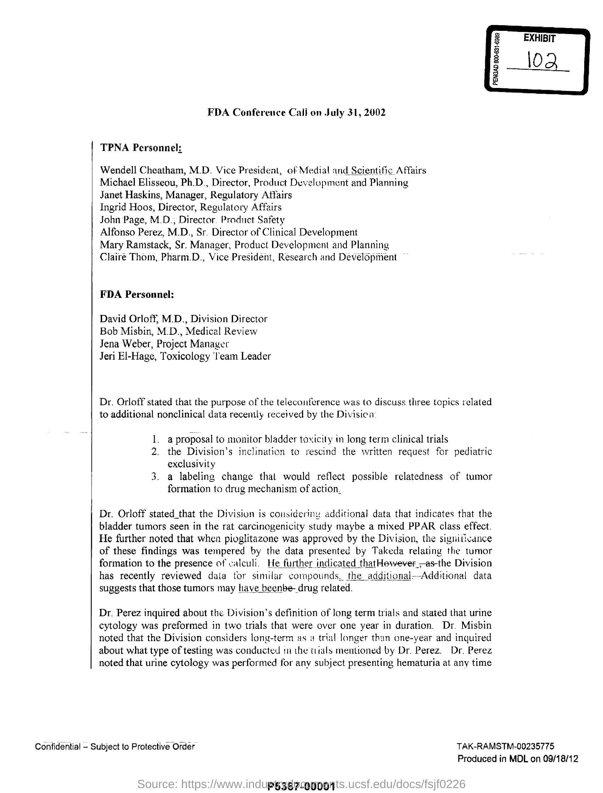
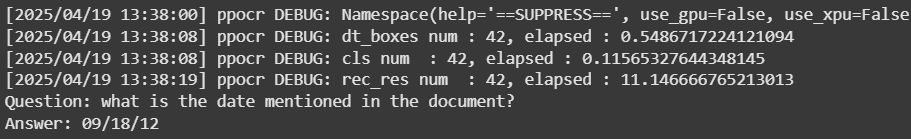
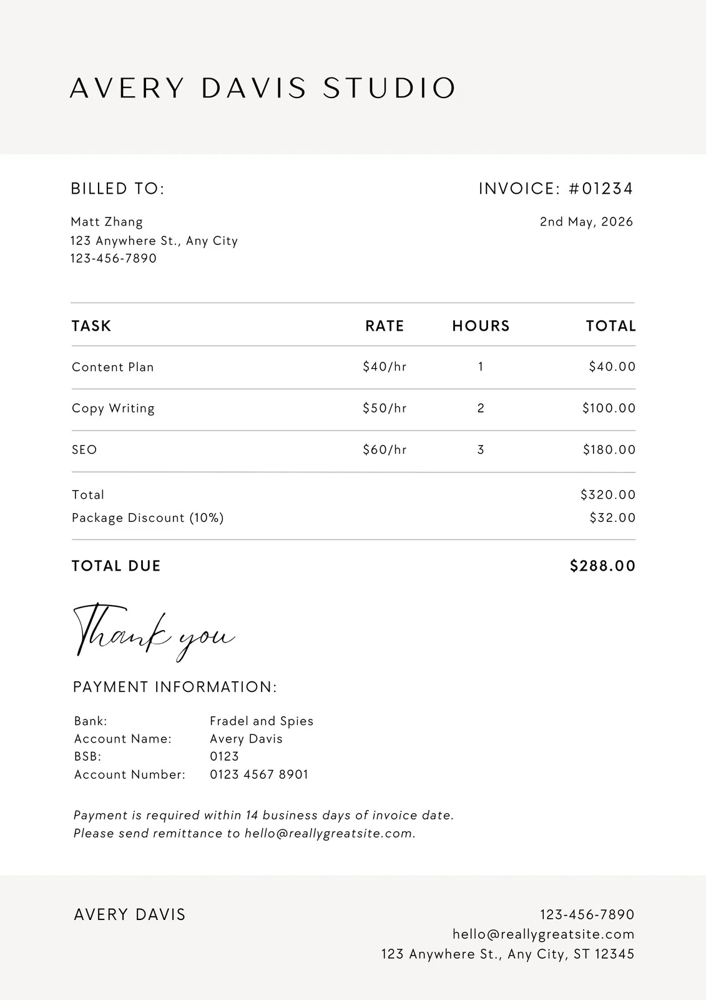
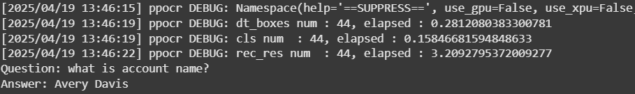
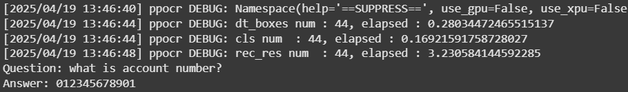

# DocumentQA-lakshya-rawat-document-qa-model


This project provides a simple pipeline for performing **Document Question Answering (DocQA)** using a pre-trained model. It extracts relevant answers from images of documents based on user queries.

## 🚀 How to Use

### Clone repo
```bash
git clone https://github.com/Lakshyasinghrawat12/DocumentQA-lakshya-rawat-document-qa-model.git
cd DocumentQA-lakshya-rawat-document-qa-model
```

### Set Up a Virtual Environment (Recommended)

```python
python -m venv venv
source venv/bin/activate  # On Windows: venv\Scripts\activate
```

### Install Dependencies
```python
pip install -r requirements.txt
```

### Run the Document QA Model

Ensure you have a test image (containing the document) placed in the project directory.

Then run:
```python
python main.py

```

## File Structure

```bash
.
├── main.py              # Main script to run the DocQA model
├── requirements.txt     # List of dependencies
├── test_image.png       # Sample image to test the model (you can replace it)
└── README.md
```


# 📝 Notes

- Make sure your test image is in a supported format (e.g., .png, .jpg, .jpeg, .pdf if supported) if using custom images.

- The model is trained over 1200 Document visual question and ansewers so the format maybe a bit off according to expectations.

- You can customize main.py to accept dynamic images and questions.


## 📝 Example Usage

### 📄 Input Document 1


### ✅ Extracted Answer



### 📄 Input Document


### ✅ Extracted Answer





---

## 🔗 Links

- 🤗 Hugging Face Profile: [@lakshya-rawat](https://huggingface.co/lakshya-rawat)
- 🤗 Document QA Model: [document-qa-model](https://huggingface.co/lakshya-rawat/document-qa-model)


# 🤝 Contributing

**Feel free to open issues or submit pull requests to improve the project!**
